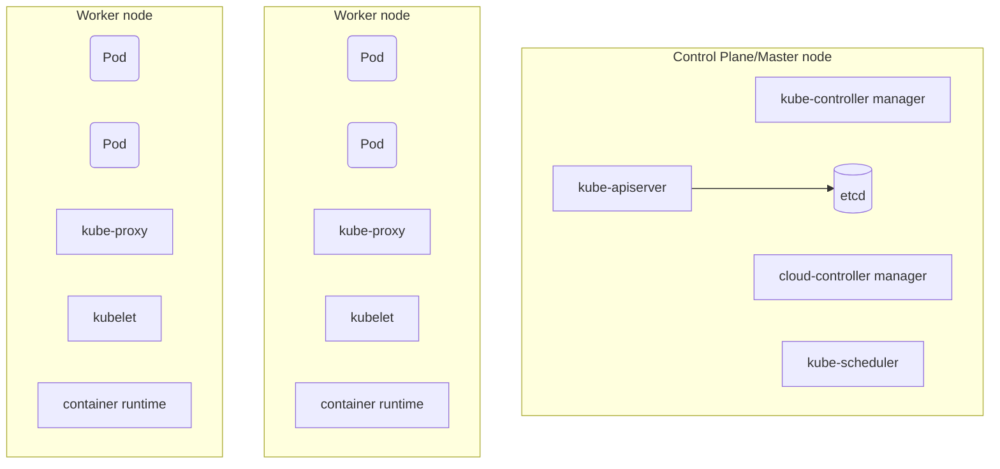

# Node

Nodes are physical or virtual machines. Together they form the cluster

## Types of nodes
- Master node or Control plane
- Worker nodes

## Architecture


## Master Node

### kube-apiserver
- Exposes REST API and client tool like K8s cli to interact with the REST API interface
- Saves the state to the datastore ```etcd```
- All clients interact with the apiserver, never with the datastore

### etcd
- Act as the cluster datastore to store state
- It's a key-value store
- Not a database or a datastore to use by apllications
- It is a single point of truth in kubernetes

### kube-control manager
- It is the controller of controllers
- It runs controllers:
  - Node controller
  - Replication controller
  - Endpoints controller
  - Service Accounts and token controllers

### cloud-control manager
- It is used to interact with the cloud provided controllers
  - Node : For checking the cloud provider to determine if a node is deleted in the cloud after it stops responding
  - Routes : For setting up routes in the underlying cloud infrastructure
  - Service : For creating/updating/deleting cloud provider load balancers
  - Volumes : For creating, attaching and mounting volumes, and interacting with cloud providers to orchestrate volumes

### kube-scheduler
Watches newly created pods that have no node assigned, and selects a node for them to run on


## Worker nodes

### kubelet
- Manages the pods lifecycle
- Ensures that the containers described in the Pods specs are running and healthy

### kube-proxy
- It is a network proxy that manages network rules on nodes
- All network traffic go through the kube-proxy

### Container runtime
- K8s support various container runtimes
- Must implement the **Kubernetes Container Runtime Interface**
  * Moby
  * Containerd
  * Cri-0
  * Rkt
  * Kata
  * Virtlet
