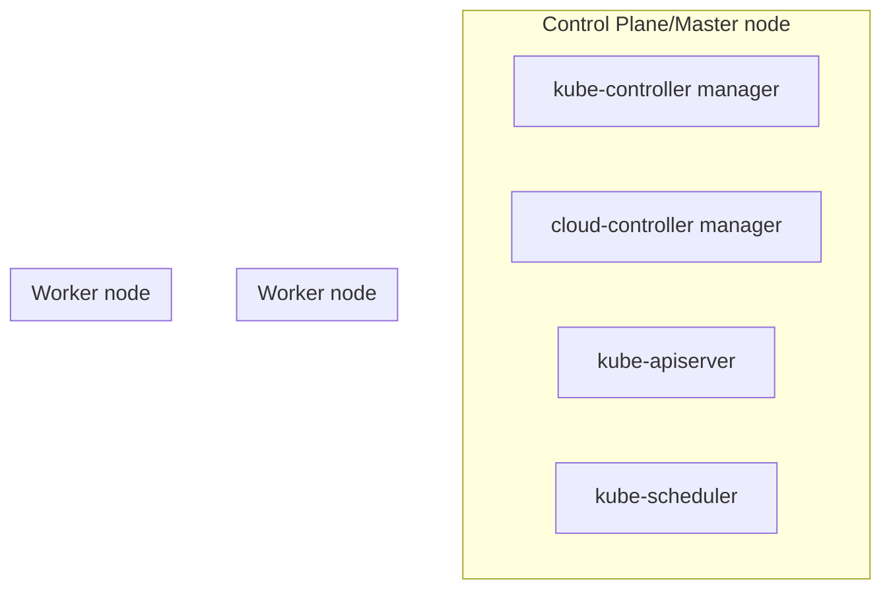

# Node

Nodes are physical or virtual machines. Together they form the cluster

## Types of nodes
- Master node or Control plane
- Worker nodes

```mermaid
flowchart TB
  subgraph "Control Plane/Master node"
  A[kube-controller manager]
  B[cloud-controller manager]
  C[kube-apiserver]
  D[kube-scheduler]
  end
  subgraph "Worker node"
  end
  subgraph "Worker node"
  end
```
  
