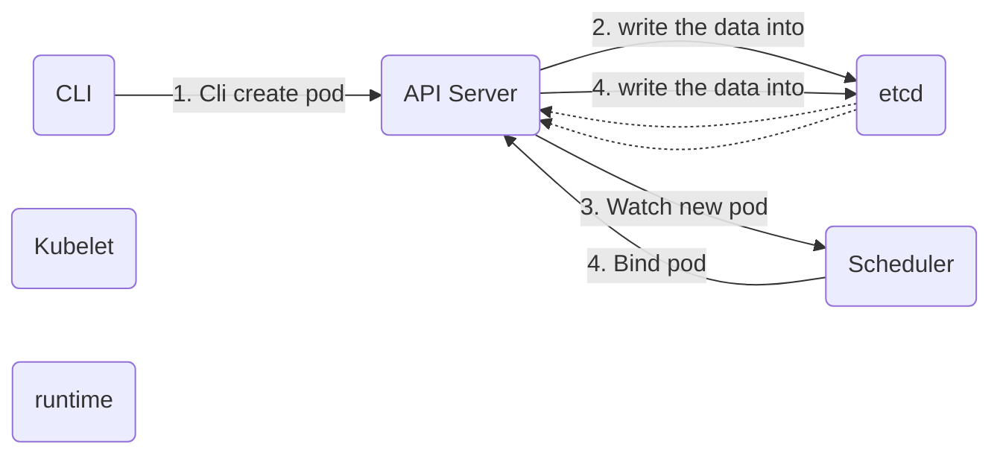

# Pod lifecycle

## Pod creation lifecycle

```mermaid

flowchart LR
  A(CLI)
  B(API Server)
  C(etcd)
  D(Scheduler)
  E(Kubelet)
  F(runtime)
  A-->|1. Cli create pod| B
  B-->|2. write the data into | C
  C -.->B
  B-->|3. Watch new pod| D
  D-->|4. Bind pod| B
  B-->|4. write the data into | C
  C -.->B
  
  
  
```
